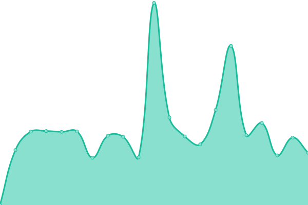
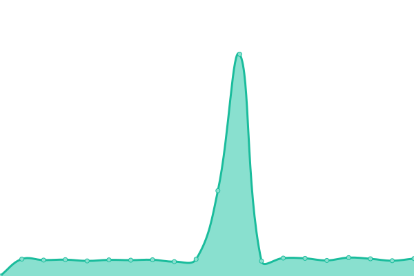

# [📈 Live Status](https://demo.upptime.js.org): <!--live status--> **🟩 All systems operational**

This repository contains the open-source uptime monitor and status page for [Mason Du](masondu.com), powered by [Upptime](https://github.com/upptime/upptime).

With [Upptime](https://upptime.js.org), you can get your own unlimited and free uptime monitor and status page, powered entirely by a GitHub repository. We use [Issues](https://github.com/mdu/mdu-github-glb-monitor-01/issues) as incident reports, [Actions](https://github.com/mdu/mdu-github-glb-monitor-01/actions) as uptime monitors, and [Pages](https://demo.upptime.js.org) for the status page.

<!--start: status pages-->
<!-- This summary is generated by Upptime (https://github.com/upptime/upptime) -->
<!-- Do not edit this manually, your changes will be overwritten -->
<!-- prettier-ignore -->
| URL | Status | History | Response Time | Uptime |
| --- | ------ | ------- | ------------- | ------ |
|  [Misiones](https://misiones.gob.ar) | 🟩 Up | [misiones.yml](https://github.com/facundomdu/mdu-github-glb-monitor-01/commits/HEAD/history/misiones.yml) | 

 3345ms
     
 | 

<a href="https://facundomdu.github.io/mdu-github-glb-monitor-01/history/misiones">98.82%</a>
    

|  [Salud](https://salud.misiones.gob.ar) | 🟩 Up | [salud.yml](https://github.com/facundomdu/mdu-github-glb-monitor-01/commits/HEAD/history/salud.yml) | 

 2704ms
     
 | 

<a href="https://facundomdu.github.io/mdu-github-glb-monitor-01/history/salud">98.83%</a>
    

|  [RPI](https://rpi.misiones.gob.ar) | 🟩 Up | [rpi.yml](https://github.com/facundomdu/mdu-github-glb-monitor-01/commits/HEAD/history/rpi.yml) | 

 3712ms
     
 | 

<a href="https://facundomdu.github.io/mdu-github-glb-monitor-01/history/rpi">98.84%</a>
    

|  [Marandu](https://marandu.com.ar) | 🟩 Up | [marandu.yml](https://github.com/facundomdu/mdu-github-glb-monitor-01/commits/HEAD/history/marandu.yml) | 

 2550ms
     
 | 

<a href="https://facundomdu.github.io/mdu-github-glb-monitor-01/history/marandu">98.85%</a>
    

<!--end: status pages-->

[**Visit our status website →**](https://facundomdu.github.io/mdu-github-glb-monitor-01)

## 📄 License

- Powered by: [Upptime](https://github.com/upptime/upptime)
- Code: [MIT](./LICENSE) © [Mason Du](masondu.com)
- Data in the `./history` directory: [Open Database License](https://opendatacommons.org/licenses/odbl/1-0/)
