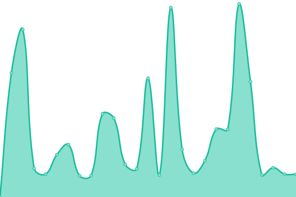

# [📈 Estado en vivo](https://facundomdu.github.io/mdu-github-glb-monitor-01/): <!--live status--> **🟩 All systems operational**

Este repositorio contiene el monitor externo de actividad y estado de las paginas para los servicios de la Provincia de Misiones. Equipos de desarrollo: [Marandu Comunicaciones SE](marandu.com.ar), [Silicon Misiones](siliconmisiones.gob.ar) con tecnologia open source.

<!--start: status pages-->
<!-- This summary is generated by Upptime (https://github.com/upptime/upptime) -->
<!-- Do not edit this manually, your changes will be overwritten -->
<!-- prettier-ignore -->
| URL | Status | History | Response Time | Uptime |
| --- | ------ | ------- | ------------- | ------ |
|  [Misiones](https://misiones.gob.ar) | 🟩 Up | [misiones.yml](https://github.com/facundomdu/mdu-github-glb-monitor-01/commits/HEAD/history/misiones.yml) | 

 8080ms
     
 | 

<a href="https://facundomdu.github.io/mdu-github-glb-monitor-01/history/misiones">97.70%</a>
    

|  [Marandu](https://marandu.com.ar) | 🟩 Up | [marandu.yml](https://github.com/facundomdu/mdu-github-glb-monitor-01/commits/HEAD/history/marandu.yml) | 

 4567ms
     
 | 

<a href="https://facundomdu.github.io/mdu-github-glb-monitor-01/history/marandu">86.13%</a>
    

|  [acmcimisionesgobar](https://acmci.misiones.gob.ar/) | 🟩 Up | [acmcimisionesgobar.yml](https://github.com/facundomdu/mdu-github-glb-monitor-01/commits/HEAD/history/acmcimisionesgobar.yml) | 

 0ms
     
 | 

<a href="https://facundomdu.github.io/mdu-github-glb-monitor-01/history/acmcimisionesgobar">0.00%</a>
    

|  [agrifam.misiones.gob.ar](https://agrifam.misiones.gob.ar/) | 🟩 Up | [agrifam-misiones-gob-ar.yml](https://github.com/facundomdu/mdu-github-glb-monitor-01/commits/HEAD/history/agrifam-misiones-gob-ar.yml) | 

 0ms
     
 | 

<a href="https://facundomdu.github.io/mdu-github-glb-monitor-01/history/agrifam-misiones-gob-ar">0.00%</a>
    

|  [agro.misiones.gob.ar](https://agro.misiones.gob.ar/) | 🟩 Up | [agro-misiones-gob-ar.yml](https://github.com/facundomdu/mdu-github-glb-monitor-01/commits/HEAD/history/agro-misiones-gob-ar.yml) | 

 0ms
     
 | 

<a href="https://facundomdu.github.io/mdu-github-glb-monitor-01/history/agro-misiones-gob-ar">0.00%</a>
    

|  [ahora.misiones.gob.ar](https://ahora.misiones.gob.ar/) | 🟩 Up | [ahora-misiones-gob-ar.yml](https://github.com/facundomdu/mdu-github-glb-monitor-01/commits/HEAD/history/ahora-misiones-gob-ar.yml) | 

 0ms
     
 | 

<a href="https://facundomdu.github.io/mdu-github-glb-monitor-01/history/ahora-misiones-gob-ar">100.00%</a>
    

|  [biofabrica.misiones.gob.ar](https://biofabrica.misiones.gob.ar/) | 🟩 Up | [biofabrica-misiones-gob-ar.yml](https://github.com/facundomdu/mdu-github-glb-monitor-01/commits/HEAD/history/biofabrica-misiones-gob-ar.yml) | 

 0ms
     
 | 

<a href="https://facundomdu.github.io/mdu-github-glb-monitor-01/history/biofabrica-misiones-gob-ar">0.00%</a>
    

|  [cea.misiones.gob.ar](https://cea.misiones.gob.ar/) | 🟩 Up | [cea-misiones-gob-ar.yml](https://github.com/facundomdu/mdu-github-glb-monitor-01/commits/HEAD/history/cea-misiones-gob-ar.yml) | 

 0ms
     
 | 

<a href="https://facundomdu.github.io/mdu-github-glb-monitor-01/history/cea-misiones-gob-ar">0.00%</a>
    

|  [ceambiental.misiones.gob.ar](https://ceambiental.misiones.gob.ar/) | 🟩 Up | [ceambiental-misiones-gob-ar.yml](https://github.com/facundomdu/mdu-github-glb-monitor-01/commits/HEAD/history/ceambiental-misiones-gob-ar.yml) | 

 0ms
     
 | 

<a href="https://facundomdu.github.io/mdu-github-glb-monitor-01/history/ceambiental-misiones-gob-ar">0.00%</a>
    

|  [www.cocinamisionera.com.ar](https://www.cocinamisionera.com.ar/) | 🟩 Up | [www-cocinamisionera-com-ar.yml](https://github.com/facundomdu/mdu-github-glb-monitor-01/commits/HEAD/history/www-cocinamisionera-com-ar.yml) | 

 0ms
     
 | 

<a href="https://facundomdu.github.io/mdu-github-glb-monitor-01/history/www-cocinamisionera-com-ar">0.00%</a>
    

|  [comunicacion.misiones.gob.ar](https://comunicacion.misiones.gob.ar/) | 🟩 Up | [comunicacion-misiones-gob-ar.yml](https://github.com/facundomdu/mdu-github-glb-monitor-01/commits/HEAD/history/comunicacion-misiones-gob-ar.yml) | 

 0ms
     
 | 

<a href="https://facundomdu.github.io/mdu-github-glb-monitor-01/history/comunicacion-misiones-gob-ar">0.00%</a>
    

|  [congresojovenesfira-cila.com.ar](https://congresojovenesfira-cila.com.ar/) | 🟩 Up | [congresojovenesfira-cila-com-ar.yml](https://github.com/facundomdu/mdu-github-glb-monitor-01/commits/HEAD/history/congresojovenesfira-cila-com-ar.yml) | 

 0ms
     
 | 

<a href="https://facundomdu.github.io/mdu-github-glb-monitor-01/history/congresojovenesfira-cila-com-ar">0.00%</a>
    

|  [defensoriadennya.misiones.gob.ar](https://defensoriadennya.misiones.gob.ar/) | 🟩 Up | [defensoriadennya-misiones-gob-ar.yml](https://github.com/facundomdu/mdu-github-glb-monitor-01/commits/HEAD/history/defensoriadennya-misiones-gob-ar.yml) | 

 0ms
     
 | 

<a href="https://facundomdu.github.io/mdu-github-glb-monitor-01/history/defensoriadennya-misiones-gob-ar">0.00%</a>
    

|  [derechoshumanos.misiones.gob.ar](https://derechoshumanos.misiones.gob.ar/) | 🟩 Up | [derechoshumanos-misiones-gob-ar.yml](https://github.com/facundomdu/mdu-github-glb-monitor-01/commits/HEAD/history/derechoshumanos-misiones-gob-ar.yml) | 

 0ms
     
 | 

<a href="https://facundomdu.github.io/mdu-github-glb-monitor-01/history/derechoshumanos-misiones-gob-ar">0.00%</a>
    

|  [desarrollosocial.misiones.gob.ar](https://desarrollosocial.misiones.gob.ar/) | 🟩 Up | [desarrollosocial-misiones-gob-ar.yml](https://github.com/facundomdu/mdu-github-glb-monitor-01/commits/HEAD/history/desarrollosocial-misiones-gob-ar.yml) | 

 0ms
     
 | 

<a href="https://facundomdu.github.io/mdu-github-glb-monitor-01/history/desarrollosocial-misiones-gob-ar">0.00%</a>
    

|  [ecologia.misiones.gob.ar](https://ecologia.misiones.gob.ar/) | 🟩 Up | [ecologia-misiones-gob-ar.yml](https://github.com/facundomdu/mdu-github-glb-monitor-01/commits/HEAD/history/ecologia-misiones-gob-ar.yml) | 

 0ms
     
 | 

<a href="https://facundomdu.github.io/mdu-github-glb-monitor-01/history/ecologia-misiones-gob-ar">0.00%</a>
    

|  [edu.misiones.gob.ar](https://edu.misiones.gob.ar/) | 🟩 Up | [edu-misiones-gob-ar.yml](https://github.com/facundomdu/mdu-github-glb-monitor-01/commits/HEAD/history/edu-misiones-gob-ar.yml) | 

 0ms
     
 | 

<a href="https://facundomdu.github.io/mdu-github-glb-monitor-01/history/edu-misiones-gob-ar">0.00%</a>
    

|  [expomujer.misiones.gob.ar](https://expomujer.misiones.gob.ar/) | 🟩 Up | [expomujer-misiones-gob-ar.yml](https://github.com/facundomdu/mdu-github-glb-monitor-01/commits/HEAD/history/expomujer-misiones-gob-ar.yml) | 

 0ms
     
 | 

<a href="https://facundomdu.github.io/mdu-github-glb-monitor-01/history/expomujer-misiones-gob-ar">0.00%</a>
    

|  [fiestadelinmigrante.com.ar](https://fiestadelinmigrante.com.ar/) | 🟩 Up | [fiestadelinmigrante-com-ar.yml](https://github.com/facundomdu/mdu-github-glb-monitor-01/commits/HEAD/history/fiestadelinmigrante-com-ar.yml) | 

 0ms
     
 | 

<a href="https://facundomdu.github.io/mdu-github-glb-monitor-01/history/fiestadelinmigrante-com-ar">0.00%</a>
    

|  [fiscaliadeestado.misiones.gob.ar](https://fiscaliadeestado.misiones.gob.ar/) | 🟩 Up | [fiscaliadeestado-misiones-gob-ar.yml](https://github.com/facundomdu/mdu-github-glb-monitor-01/commits/HEAD/history/fiscaliadeestado-misiones-gob-ar.yml) | 

 0ms
     
 | 

<a href="https://facundomdu.github.io/mdu-github-glb-monitor-01/history/fiscaliadeestado-misiones-gob-ar">0.00%</a>
    

|  [fondocredito.misiones.gob.ar](https://fondocredito.misiones.gob.ar/) | 🟩 Up | [fondocredito-misiones-gob-ar.yml](https://github.com/facundomdu/mdu-github-glb-monitor-01/commits/HEAD/history/fondocredito-misiones-gob-ar.yml) | 

 0ms
     
 | 

<a href="https://facundomdu.github.io/mdu-github-glb-monitor-01/history/fondocredito-misiones-gob-ar">0.00%</a>
    

|  [gobierno.misiones.gob.ar](https://gobierno.misiones.gob.ar/) | 🟩 Up | [gobierno-misiones-gob-ar.yml](https://github.com/facundomdu/mdu-github-glb-monitor-01/commits/HEAD/history/gobierno-misiones-gob-ar.yml) | 

 0ms
     
 | 

<a href="https://facundomdu.github.io/mdu-github-glb-monitor-01/history/gobierno-misiones-gob-ar">0.00%</a>
    

|  [guacurari.misiones.gob.ar](https://guacurari.misiones.gob.ar) | 🟩 Up | [guacurari-misiones-gob-ar.yml](https://github.com/facundomdu/mdu-github-glb-monitor-01/commits/HEAD/history/guacurari-misiones-gob-ar.yml) | 

 0ms
     
 | 

<a href="https://facundomdu.github.io/mdu-github-glb-monitor-01/history/guacurari-misiones-gob-ar">100.00%</a>
    

|  [htc.misiones.gob.ar](https://htc.misiones.gob.ar/) | 🟩 Up | [htc-misiones-gob-ar.yml](https://github.com/facundomdu/mdu-github-glb-monitor-01/commits/HEAD/history/htc-misiones-gob-ar.yml) | 

 0ms
     
 | 

<a href="https://facundomdu.github.io/mdu-github-glb-monitor-01/history/htc-misiones-gob-ar">0.00%</a>
    

|  [iaavim.misiones.gob.ar](https://iaavim.misiones.gob.ar/) | 🟩 Up | [iaavim-misiones-gob-ar.yml](https://github.com/facundomdu/mdu-github-glb-monitor-01/commits/HEAD/history/iaavim-misiones-gob-ar.yml) | 

 0ms
     
 | 

<a href="https://facundomdu.github.io/mdu-github-glb-monitor-01/history/iaavim-misiones-gob-ar">100.00%</a>
    

|  [ide.marandu.com.ar](https://ide.marandu.com.ar/) | 🟩 Up | [ide-marandu-com-ar.yml](https://github.com/facundomdu/mdu-github-glb-monitor-01/commits/HEAD/history/ide-marandu-com-ar.yml) | 

 0ms
     
 | 

<a href="https://facundomdu.github.io/mdu-github-glb-monitor-01/history/ide-marandu-com-ar">0.00%</a>
    

|  [www.misiones.gob.ar](https://www.misiones.gob.ar/) | 🟩 Up | [www-misiones-gob-ar.yml](https://github.com/facundomdu/mdu-github-glb-monitor-01/commits/HEAD/history/www-misiones-gob-ar.yml) | 

 0ms
     
 | 

<a href="https://facundomdu.github.io/mdu-github-glb-monitor-01/history/www-misiones-gob-ar">0.00%</a>
    

|  [museocambas.marandu.com.ar](https://museocambas.marandu.com.ar/) | 🟩 Up | [museocambas-marandu-com-ar.yml](https://github.com/facundomdu/mdu-github-glb-monitor-01/commits/HEAD/history/museocambas-marandu-com-ar.yml) | 

 0ms
     
 | 

<a href="https://facundomdu.github.io/mdu-github-glb-monitor-01/history/museocambas-marandu-com-ar">0.00%</a>
    

|  [rpi.misiones.gob.ar](https://rpi.misiones.gob.ar) | 🟩 Up | [rpi-misiones-gob-ar.yml](https://github.com/facundomdu/mdu-github-glb-monitor-01/commits/HEAD/history/rpi-misiones-gob-ar.yml) | 

 0ms
     
 | 

<a href="https://facundomdu.github.io/mdu-github-glb-monitor-01/history/rpi-misiones-gob-ar">0.00%</a>
    

|  [salud.misiones.gob.ar](https://salud.misiones.gob.ar) | 🟩 Up | [salud-misiones-gob-ar.yml](https://github.com/facundomdu/mdu-github-glb-monitor-01/commits/HEAD/history/salud-misiones-gob-ar.yml) | 

 0ms
     
 | 

<a href="https://facundomdu.github.io/mdu-github-glb-monitor-01/history/salud-misiones-gob-ar">0.00%</a>
    

|  [trabajomisionesgob_ar](https://trabajo.misiones.gob.ar/) | 🟩 Up | [trabajomisionesgob-ar.yml](https://github.com/facundomdu/mdu-github-glb-monitor-01/commits/HEAD/history/trabajomisionesgob-ar.yml) | 

 0ms
     
 | 

<a href="https://facundomdu.github.io/mdu-github-glb-monitor-01/history/trabajomisionesgob-ar">0.00%</a>
    

|  [sysrpimisionesgob-ar](https://sys.rpi.misiones.gob.ar) | 🟩 Up | [sysrpimisionesgob-ar.yml](https://github.com/facundomdu/mdu-github-glb-monitor-01/commits/HEAD/history/sysrpimisionesgob-ar.yml) | 

 0ms
     
 | 

<a href="https://facundomdu.github.io/mdu-github-glb-monitor-01/history/sysrpimisionesgob-ar">100.00%</a>
    

|  [cio911misionesgobar](http://cio911.misiones.gob.ar/) | 🟩 Up | [cio911misionesgobar.yml](https://github.com/facundomdu/mdu-github-glb-monitor-01/commits/HEAD/history/cio911misionesgobar.yml) | 

 0ms
     
 | 

<a href="https://facundomdu.github.io/mdu-github-glb-monitor-01/history/cio911misionesgobar">100.00%</a>
    

|  [electoralA](https://electoral2021.misiones.gob.ar/) | 🟩 Up | [electoral-a.yml](https://github.com/facundomdu/mdu-github-glb-monitor-01/commits/HEAD/history/electoral-a.yml) | 

 0ms
     
 | 

<a href="https://facundomdu.github.io/mdu-github-glb-monitor-01/history/electoral-a">0.00%</a>
    

|  [electoralB](https://electoral2021.misiones.gob.ar/) | 🟩 Up | [electoral-b.yml](https://github.com/facundomdu/mdu-github-glb-monitor-01/commits/HEAD/history/electoral-b.yml) | 

 0ms
     
 | 

<a href="https://facundomdu.github.io/mdu-github-glb-monitor-01/history/electoral-b">0.00%</a>
    

<!--end: status pages-->

[**Pagina de estado en github →**](https://facundomdu.github.io/mdu-github-glb-monitor-01)

## 📄 Licencia

- Powered by: [Upptime](https://github.com/upptime/upptime)
- Code: [MIT](./LICENSE) © [Mason Du](masondu.com)
- Data in the `./history` directory: [Open Database License](https://opendatacommons.org/licenses/odbl/1-0/)
